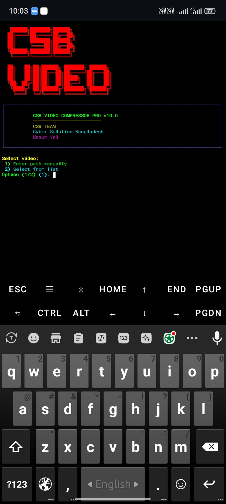
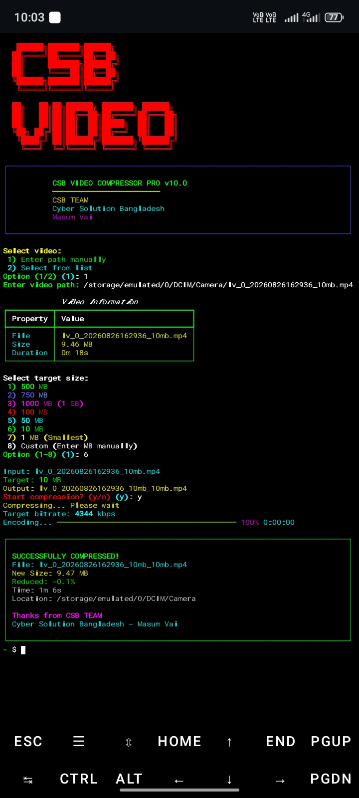

# 🎬 CSB Video Compressor Pro

<div align="center">


</div>

---

## 📌 About

**CSB Video Compressor Pro** is a powerful and user-friendly video compression tool built for **Termux**. It allows you to reduce video file sizes quickly with a beautiful CLI interface.

### ✨ Features

- 📹 **Compress Videos** – Reduce video size from GB to MB
- 🎯 **Multiple Options** – 500MB, 750MB, 1GB, 100MB, 50MB, 10MB, 1MB
- 🎨 **Beautiful UI** – Colorful and professional ASCII banner
- 📊 **Live Progress** – Real-time compression progress bar
- 🔍 **Auto Find** – Automatically detects all videos on your device
- ⚡ **Fast Encoding** – Single-pass encoding for quick compression
- 📈 **Compression Stats** – Shows percentage reduced and time taken

---

## 📸 Screenshots

### Home Screen


### Compression Progress


---

## 🚀 Installation

### Step 1: Update Termux
```bash
pkg update && pkg upgrade -y
```

Step 2: Install Dependencies

```bash
pkg install python ffmpeg -y
pip install rich
```

Step 3: Download the Tool

```bash
git clone https://github.com/yourusername/csb-video-compressor.git
cd csb-video-compressor
```

Step 4: Give Permission

```bash
chmod +x csb-clean.py
```

Step 5: Run

```bash
python csb-clean.py
```

---

🛠️ Usage Guide

Option 1: Enter Path Manually

1. Select option 1
2. Enter the full video path
   ```
   Example: /storage/emulated/0/DCIM/Camera/video.mp4
   ```

Option 2: Select from List

1. Select option 2
2. Choose video number from the list
3. Select target size
4. Confirm and wait for compression

---

📋 Available Target Sizes

Option Size
1 500 MB
2 750 MB
3 1000 MB (1 GB)
4 100 MB
5 50 MB
6 10 MB
7 1 MB (Smallest)
8 Custom (Manual)

---

💡 Tips

· 🎯 For best quality, choose a target size close to the original
· ⚡ Use Option 1 if you know the exact path
· 🔍 Use Option 2 if you're not sure where the video is
· 📱 Make sure you have enough storage space
· 🎬 The compressed file will be saved in the same folder

---
⚙️ Requirements

· Termux (Android)
· Python 3.7+
· FFmpeg
· Rich library
· Minimum 50MB free space

---

🔧 Troubleshooting

❌ ffprobe not found

```bash
pkg install ffmpeg -y
```

❌ rich module not found

```bash
pip install rich
```

❌ Permission denied

```bash
termux-setup-storage
```

❌ File not found

Make sure the path is correct. Example:

```bash
/storage/emulated/0/DCIM/Camera/video.mp4
```

---

👨‍💻 Credits

Developed by:

· CSB TEAM
· Cyber Solution Bangladesh
· Masum Vai

---

📜 License

This project is licensed under the MIT License. See the LICENSE file for details.

---

🤝 Contributing

Feel free to contribute by:

1. Forking the repository
2. Making changes
3. Submitting a pull request

---

⭐ Support

If you like this tool, don't forget to:

· ⭐ Star the repository
· 🔄 Share with your friends
· 🐛 Report issues

---

<div align="center">

⬆ Back to Top

Made with ❤️ by CSB TEAM

</div>
```
---
